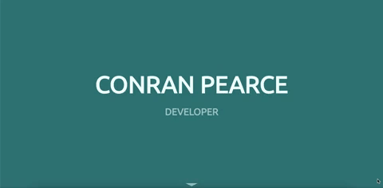

<h1 align="center">
  <a href="https://conranpearce.github.io/">:wave: conranpearce.github.io</a>
</h1>

<p align="center">Basic static website for displaying information about myself :man:
</p>

<p align="center">HTML5 and CSS3 have been used to create the website.
</p>

<p align="center">
  
</p>

## Deployment

Netlify has been linked to the GitHub repository to be able to have live sites up to date with the code being committed.

Develop branch hosted using Netlify live site at https://conranpearce-develop.netlify.app

Live deployment through GitHub Pages at https://conranpearce.github.io/

## Prerequisites
- node
- [node-sass](https://www.npmjs.com/package/node-sass) (global install) or [Live Sass Compiler](https://marketplace.visualstudio.com/items?itemName=ritwickdey.live-sass) (Visual Studio Code)

## 
[formspree.io](https://formspree.io/) has been used for a contact form on a static website.

## Compatability :computer: :iphone:
The page should be able to be displayed upon various browsers and media, with slight alterations to fit the display.

## Steps to run
- git clone this repo
- cd into this repo
- For CSS Pre-Processing (using [node-sass](https://www.npmjs.com/package/node-sass))  change into 'stylesheets' folder and run the command
  ```node-sass sass --watch -o css```
